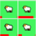

# Prey - Predator Model

Carl RIZK

David DE LA HERA CARRETERO

# Summary

The simulation world is a 2D grid which contains 3 agents: wolves, sheeps and grass patches.  
The simulation follows the food chain:

- Wolf eats sheep.
- Sheep eats grass.

At each simulation step:

- Grass grows.
- Sheep moves, can eat grass, can reproduce, dies if eaten or out of energy.
- Wolf moves, can eats sheep, can reproduce, dies if out of energy.

All these actions are explained later in the document.

# Simulation World:

## Internal State:

- `moore` (bool): Should the world use Moore Neighborhood or Von Newman Neighborhood for movement.
- `grass_progress_per_step` (int): The amount of `progress` to add to each `GrassPatch` each simulation step.
- `sheep_initial_count` (int): The number of sheeps to create at the start of the simulation.
- `sheep_energy_step_expenditure` (int): The amount of `energy` used by the sheeps each simulation step.
- `sheep_energy_gain_from_food` (int): The amount of `energy` recovered by the sheep after eating grass.
- `sheep_reproduction_energy_cost` (int): The amount of `energy` spent by the sheep to reproduce.
- `sheep_reproduction_chance` (float): The chance of a sheep reproducing if it has enough `energy`.
- `wolf_initial_count` (int): The number of wolves to create at the start of the simulation.
- `wolf_energy_step_expenditure` (int): The amount of `energy` used by the wolves each simulation step.
- `wolf_energy_gain_from_food` (int): The amount of `energy` recovered by the wolf after eating a sheep.
- `wolf_reproduction_energy_cost` (int): The amount of `energy` spent by the wolf to reproduce.
- `wolf_reproduction_chance` (float): The chance of a wolf reproducing if it has enough `energy`.

## Behavior:

On initialization:

- Distribute `sheep_initial_count` sheeps on empty cells of the grid, each with random starting `energy`.
- Distribute `wolf_initial_count` wolves on empty cells of the grid, each with random starting `energy`.
- Create a grass patch with a random `progress` in each cell of the grid.

On Simulation Step:

- Step all the agents.
- Only one of these can happen (first have higher priority):
  - If an animal has 0 `energy`, kill it.
  - If an animal's `is_hungry` is set to `true` and the animal is on a tile with an eatable agent, the animal eats the other agent (explained below).
  - If an animal's `can_reproduce` is set to `true` the animal has a chance to reproduce equal to `reproduction_chance`:
    - The new animal is created in the same cell as the parent animal with `energy = 2 * energy_step_expenditure + 1`.
    - The parent animal looses `reproduction_energy_cost` `energy`.

Eating behavior:

The order of eating is the follow: wolves eat first, sheeps eat second.

- For `Wolf`:

  - Conditions:
    - Is on the same cell as a `Sheep`.
  - Effects:
    - Kill the sheep.
    - Increase the wolf's `energy` by `energy_gain_from_food`.

- For `Sheep`:
  - Conditions:
    - Is on the same cell as a `GrassPatch` with `fully_grown` set to `true`.
  - Effects:
    - Set the grass `progress` to 0 and `fully_grown` to `false`.
    - Increase the sheep's `energy` by `energy_gain_from_food`.

# Agents

## `GrassPatch`:

### Internal State:

- `progress` (int [0 - 100]): The percentage growth of the patch.
- `progress_per_step` (int): The percentage increase of the growth for a simulation step.
- `fully_grown` (bool): Is the grass fully grown and ready to eat.

### Behavior:

Each simulation step:

- The patch growth percentage `progress` increases by `progress_per_step`.
- If `progress` is `100`, the patch is considered `fully_grown`.

### Display

The grass patch is displayed as a rectangle with a width equal to the cell width and a height proportional to the growth `progress`.
If the patch is not `fully_grown`, it will be yellow.
If the patch is `fully_grown`, it will be green.

## `RandomWalker` (Abstract):

### Internal State

- `grid` (MultiGrid): The grid in which the agent lives.
- `pos` (int, int): The agents current position in the grid.
- `moore` (bool): If True, may move in all 8 directions. Otherwise, only up, down, left, right.

### Behavior

Each simulation step:

- Move to a random neighboring cell or stay in the current cell.

## `Animal` (Abstract) (Inherits `RandomWalker`):

### Internal State

- `energy` (int [0 - 100]): The percentage of energy the animal has.
- `energy_step_expenditure` (int): The percentage of energy the animal uses each step.
- `energy_gain_from_food` (int): The percentage of energy the animal gains from eating.
- `reproduction_energy_cost` (int): The percentage of energy the animal looses when reproducing.
- `reproduction_chance` (float): The chance the animal has to reproduce if it has enough energy.
- `is_hungry` (bool): Is the animal hungry.
- `can_reproduce` (bool): Can the animal reproduce.

### Behavior

Each simulation step:

- Reduce the `energy` by `step_energy_expenditure`.
- Set `is_hungry` to `true` if `energy <= 100 - energy_gain_from_food` else, set it to `false`.
- Set `can_reproduce` to `true` if `energy > step_energy_expenditure + reproduction_energy_cost`, else set it to `false`.

### Display

A red progress bar shows the `energy` percentage.

## Sheep (Inherits `Animal`)

### Display

The sheep is displayed using an image of a sheep.

## Wolf (Inherits `Animal`)

### Display

The wolf is displayed using an image of a wolf.

# Metodology of parameters

After trying different parameters and thanks to the graphs that we've used, notably the graphic with the number of wolves, we could deduce the need of different parameter values such as a higher `energy_gain_from_food`, `reproduction_cost`, `reproduction_chance` and a lower `energy_spenditure_each_step` compared to the sheeps in order to achieve an stable population of around 13 wolves and 100 sheeps.
You can see in server.py the default parameters that allows us to reach the equilibrium point.

# Screenshot

